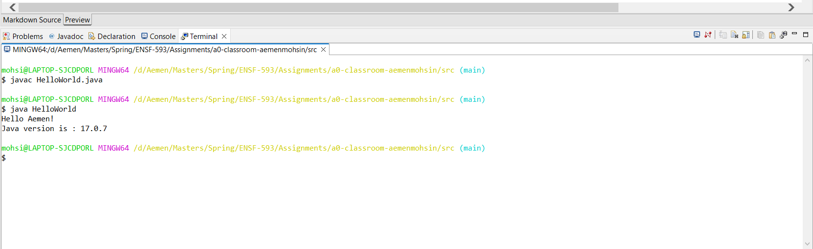

# a0-classroom
A repository to practice github steps.

Author: Aemen Mohsin

# What to do
1. Clone this repository to your local computer.
1. Change author information in `README.md` and `src/HelloWorld.java` to your first and last name
1. Add your changes to git with `git add README.md src/HelloWorld.java`, followed by `git commit -m 'changed author information'`
1. Edit `src/HelloWorld.java` such that the output is changed from 'Hello World!' to 'Hello yourname!', e.g. 'Hello Laura!'. 
1. Verify that the output is correct by running `src/HelloWorld.java`.
1. Add your changes to git with `git add src/HelloWorld.java`, followed by `git commit -m 'changed greeting'`
1. Create a screenshot of the terminal showing successful execution, save as `screenshot.png` in this directory.
1. Edit `README.md` (this file) and update the *How to run the program* section to match your program.
1. Commit both modified `README.md` and `screenshot.png` to git.
1. Push local git history to github `git push`

Note that `README.md` is a markdown file. Special syntax takes care of formatting. There are many cheat-sheets online to get you started. Here is one: https://github.com/adam-p/markdown-here/wiki/Markdown-Cheatsheet

# How to run the program
The Java program `src/HelloWorld.java` greets me. To run from command line, first open the directory: 'mohsi@LAPTOP-SJCDPORL MINGW64 /d/Aemen/Masters/Spring/ENSF-593/Assignments/a0-classroom-aemenmohsin/src' then compile with `javac HelloWorld.java` and run with `java HelloWorld`. See screenshot below for an example terminal session.

Alternatively, in Eclipse, right-click on `HelloWorld.java` in the `Package Explorer` and select `Run As->Java Application`.

